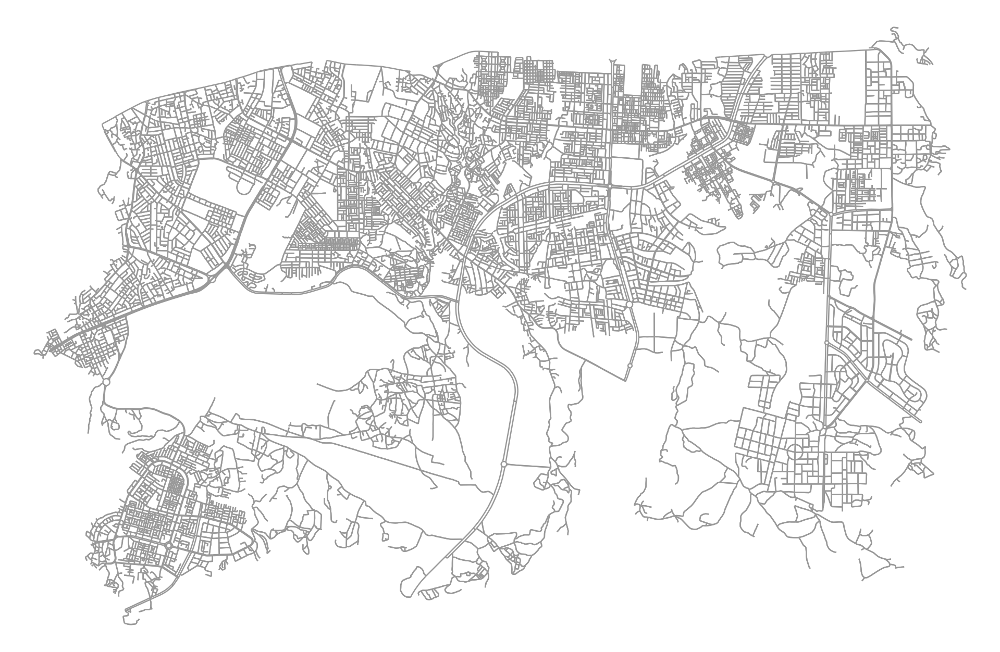
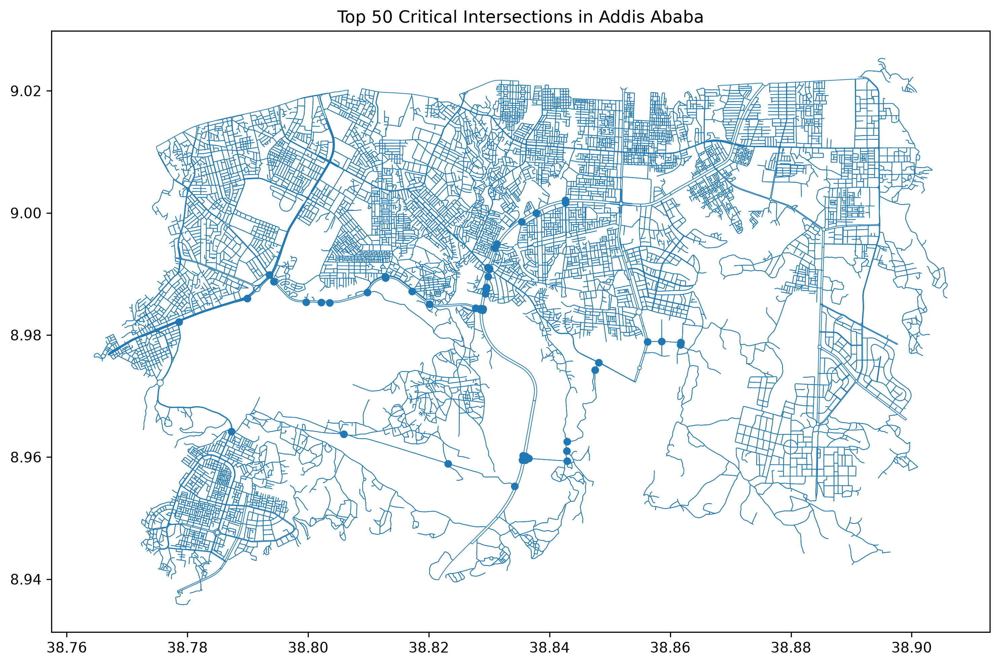
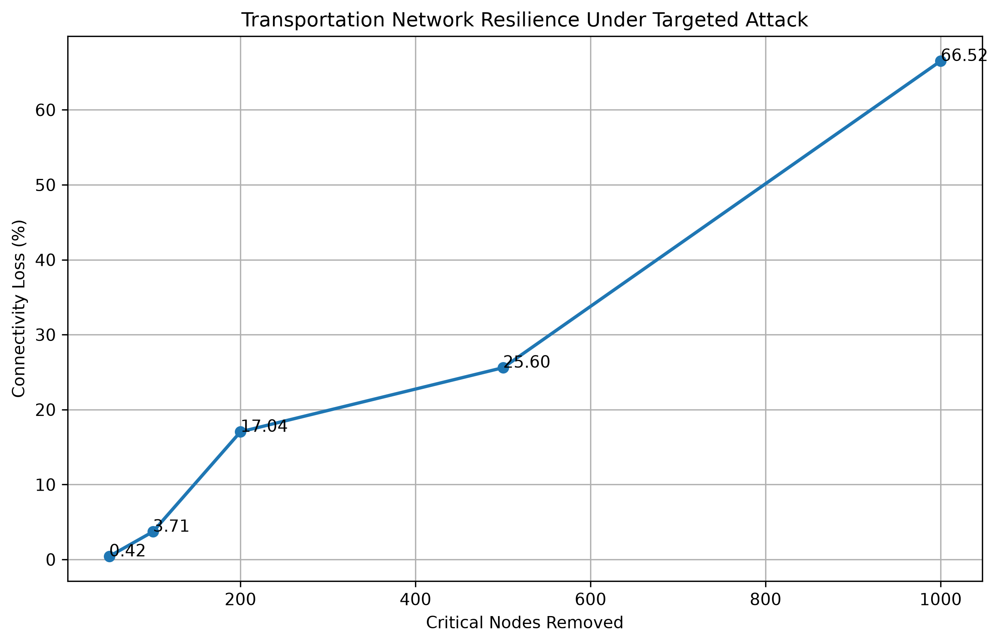
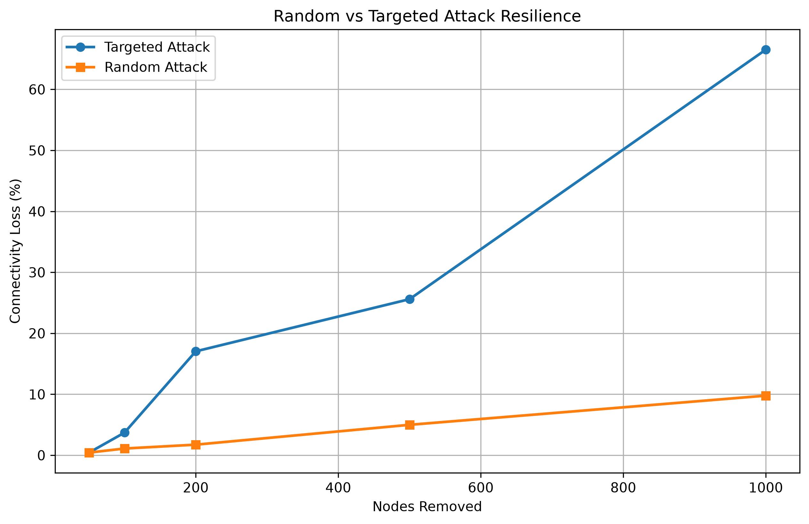
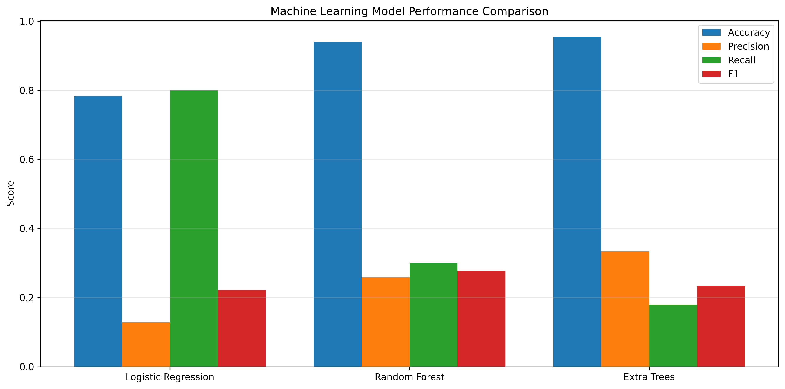
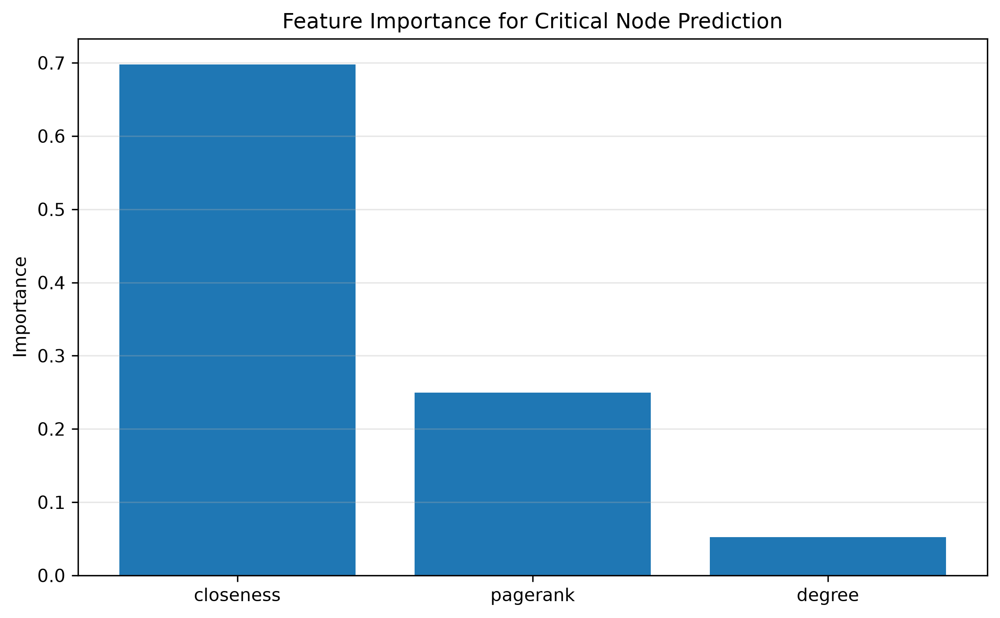

# Quantifying Urban Transportation Network Resilience Through Complex Network Analysis and Machine Learning: A Case Study of Bole Sub-City, Addis Ababa, Ethiopia

## Project Overview

Transportation networks are critical infrastructures that support mobility, economic activity, and urban development. Understanding how transportation systems respond to disruptions is essential for developing resilient and sustainable mobility strategies.

This project develops a data-driven framework for evaluating transportation network resilience, infrastructure vulnerability, accessibility degradation, and machine-learning-based critical infrastructure identification using OpenStreetMap data and complex network analysis techniques.

The study focuses on **Bole Sub-City**, one of the major commercial and transportation districts of Addis Ababa, Ethiopia.

---

## Research Motivation

Transportation disruptions can significantly affect accessibility, economic productivity, and urban mobility. Transportation planners therefore require methods for identifying vulnerable infrastructure and evaluating network robustness.

This project investigates:

* Which intersections are most critical?
* How resilient is the transportation network?
* How does accessibility change after infrastructure failures?
* Can machine learning identify vulnerable transportation infrastructure?

---

## Project Objectives

1. Construct a transportation network model of Bole Sub-City using OpenStreetMap data.

2. Identify critical transportation infrastructure using complex network analysis.

3. Evaluate transportation network resilience under targeted and random disruption scenarios.

4. Quantify accessibility degradation resulting from infrastructure failures.

5. Develop machine learning models for transportation infrastructure vulnerability assessment.

---

## Methodology

OpenStreetMap Data

↓

Transportation Network Construction

↓

Centrality Analysis

• Degree Centrality

• Betweenness Centrality

• Closeness Centrality

• PageRank

↓

Critical Infrastructure Identification

↓

Transportation Resilience Analysis

• Targeted Attack Simulation

• Random Attack Simulation

↓

Accessibility Assessment

↓

Machine Learning Framework

• Logistic Regression

• Random Forest

• Extra Trees

↓

Transportation Planning Insights

---

## Study Area

### Bole Sub-City, Addis Ababa, Ethiopia

Bole Sub-City is one of the most important transportation and commercial districts of Addis Ababa. The area contains major arterial roads, commercial centers, residential developments, and strategic transportation corridors.

---

## Transportation Network Construction

The transportation network was extracted from OpenStreetMap using OSMnx and represented as a graph where:

* Nodes represent intersections and endpoints.
* Edges represent road segments.

### Network Characteristics

| Metric | Value  |
| ------ | ------ |
| Nodes  | 12,963 |
| Edges  | 35,305 |

### Figure 1: Transportation Network

Insert:

```markdown

```

---

## Critical Infrastructure Identification

To identify critical intersections, four centrality measures were computed:

### Degree Centrality

Measures the number of direct connections associated with each node.

### Betweenness Centrality

Measures how frequently a node appears on shortest paths between other nodes.

### Closeness Centrality

Measures accessibility within the transportation network.

### PageRank

Measures strategic influence based on network structure.

### Figure 2: Critical Intersections

Insert:

```markdown

```

---

## Transportation Resilience Assessment

Two disruption scenarios were evaluated:

### Targeted Attack

Strategically important intersections were removed according to betweenness centrality rankings.

### Random Attack

Randomly selected intersections were removed from the network.

### Results

| Nodes Removed | Targeted Attack Loss (%) | Random Attack Loss (%) |
| ------------- | ------------------------ | ---------------------- |
| 50            | 0.42                     | 0.43                   |
| 100           | 3.71                     | 1.10                   |
| 200           | 17.04                    | 1.74                   |
| 500           | 25.60                    | 4.99                   |
| 1000          | 66.52                    | 9.77                   |

### Figure 3: Transportation Resilience Curve

Insert:

```markdown

```

### Figure 4: Random vs Targeted Attack Comparison

Insert:

```markdown

```

### Key Finding

The transportation network is significantly more vulnerable to targeted disruptions than random failures.

Removing 1,000 strategically important intersections resulted in approximately 66.5% connectivity loss, while random failures produced less than 10% connectivity loss.

---

## Accessibility Analysis

Accessibility was evaluated before and after critical infrastructure failures.

### Results

| Metric                    | Value  |
| ------------------------- | ------ |
| Baseline Accessibility    | 14.49  |
| Post-Attack Accessibility | 13.92  |
| Accessibility Change      | -3.92% |

### Interpretation

Accessibility degrades more slowly than overall connectivity, suggesting the presence of alternative travel routes within the transportation network.

---

## Machine Learning Analysis

Three machine learning models were evaluated:

* Logistic Regression
* Random Forest
* Extra Trees

### Features

* Degree Centrality
* Closeness Centrality
* PageRank

### Target Variable

* Critical Infrastructure Classification

### Model Performance

| Model               | Accuracy | Precision | Recall | F1     |
| ------------------- | -------- | --------- | ------ | ------ |
| Logistic Regression | 0.7829   | 0.1284    | 0.8000 | 0.2213 |
| Random Forest       | 0.9398   | 0.2586    | 0.3000 | 0.2778 |
| Extra Trees         | 0.9545   | 0.3333    | 0.1800 | 0.2338 |

### Figure 5: Machine Learning Model Comparison

Insert:

```markdown

```

### Key Finding

Random Forest achieved the highest F1-score and provided the best overall balance between precision and recall.

---

## Feature Importance Analysis

Feature importance was evaluated using the Random Forest model.

### Results

| Feature              | Relative Importance |
| -------------------- | ------------------- |
| Closeness Centrality | ~70%                |
| PageRank             | ~25%                |
| Degree Centrality    | ~5%                 |

### Figure 6: Feature Importance

Insert:

```markdown

```

### Interpretation

Accessibility-related characteristics are substantially more important than local connectivity when identifying vulnerable transportation infrastructure.

---

## Major Findings

1. The transportation network is significantly more vulnerable to targeted attacks than random failures.

2. Removing 1,000 strategically important intersections resulted in approximately 66.5% connectivity loss.

3. Accessibility degraded by approximately 3.92% following critical infrastructure failures.

4. Closeness centrality is the strongest predictor of transportation infrastructure criticality.

5. Machine learning techniques can support transportation vulnerability assessment and infrastructure prioritization.

---

## Skills Demonstrated

### Transportation Engineering

* Transportation Network Analysis
* Infrastructure Resilience Assessment
* Critical Infrastructure Identification
* Accessibility Analysis
* Transportation Planning

### Data Science

* Machine Learning
* Predictive Analytics
* Feature Engineering
* Model Evaluation

### Programming

* Python
* OSMnx
* NetworkX
* Pandas
* GeoPandas
* Scikit-Learn
* Matplotlib

### Research Skills

* Scientific Computing
* Data Analysis
* Quantitative Modeling
* Technical Reporting
* Reproducible Research

---

## Repository Structure

transport-network-resilience/

├── data/

├── figures/

├── reports/

├── src/

├── README.md

├── requirements.txt

└── .gitignore

---

## Future Work

* Dynamic Traffic Assignment
* Real Traffic Data Integration
* Intelligent Transportation Systems (ITS)
* Transportation Digital Twin Development
* Graph Neural Networks for Transportation Applications
* Extension to Larger Areas of Addis Ababa

---

## Author

**Biruhi Tesfaye Abeje**

MSc in Road and Transport Engineering

Research Interests:

* Transportation Systems
* Infrastructure Resilience
* Intelligent Transportation Systems
* Transportation Data Analytics
* Sustainable Urban Mobility
